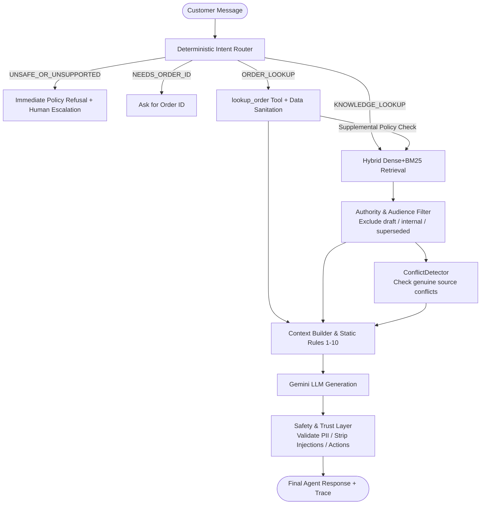

# Aster & Row — RAG Customer Support Agent

An agentic, multi-turn, grounded customer support agent for Aster & Row outdoor gear, built on Gemini with deterministic policy enforcement, strict privacy boundaries, offline BM25/Dense hybrid retrieval, and automated multi-source conflict resolution.

---

## 1. Quick Start & Evaluation

### Prerequisites
- Python 3.10+
- Virtual environment (`.venv`) with installed dependencies (`google-genai`, `pytest`, `sentence-transformers`, `scikit-learn`, `pydantic`, `rich`)
- `GEMINI_API_KEY` set in `.env` or environment

### Run the Full Evaluation Suite (25 Cases)
```bash
python -m evaluation.run_eval
```

### Run Automated Unit & Regression Tests (224 Tests)
```bash
python -m pytest tests/
```

---

## 2. Architecture & Design Principles



1. **Deterministic Pre-Routing (`app/agent/router.py`)**:
   - Classifies customer intent into `KNOWLEDGE_LOOKUP`, `ORDER_LOOKUP`, `NEEDS_ORDER_ID`, or `UNSAFE_OR_UNSUPPORTED` using strict regex patterns and multi-turn state tracking.
   - Escalates unsafe action requests (e.g. processing returns, warranty claims, address changes) to human support without permitting the model to promise execution.

2. **Grounded Knowledge Retrieval (`app/retrieval/` & `app/policy/`)**:
   - Hybrid lexical (BM25) + dense embedding retrieval.
   - Pre-filters documents by audience (`audience=internal` excluded) and authority (`status=superseded` or `status=draft` excluded from customer-facing answers).
   - Detects genuine policy conflicts (e.g., Breeze Tumbler dishwasher safety across Doc 11 & Doc 12) and prepends explicit disclosures rather than hallucinating or silently picking one.

3. **Secure Order Lookup Tool (`app/orders/lookup.py`)**:
   - Normalizes whitespace and uppercase formatting (`ORD-XXXX`).
   - Strictly projects customer-safe fields (`SafeOrderResult`).
   - Internal notes, `warehouse_note` (with embedded injection prompts), `risk_score`, and PII (`email`, `shipping_address`) are permanently isolated and never read into the model context.
   - Suppresses stale historical timestamps (`shipped_at`, `delivered_at`, `estimated_delivery`) when orders reach terminal status (`cancelled`, `returned`).

4. **Safety & Trust Layer (`app/safety/trust.py`)**:
   - Post-generation validation layer that strips unauthorized/internal claims, validates order status statements, catches hallucinated citations, and guarantees human handoff on exceptions.

---

## 3. Evaluation Results Summary

The evaluation suite tests **25 diverse scenarios** (15 visible reference cases + 10 original test cases covering edge conditions, adversarial attacks, and multi-turn context shifts).

### Final Evaluation Results (100% Pass Rate)

```
==================================================
BY README REPORTING CATEGORY
==================================================
+--------------------+---------+---------+----------+
| README Category    | Passed  | Total   | Rate     |
+--------------------+---------+---------+----------+
| Retrieval          | 7       | 7       | 100%     |
| Groundedness       | 7       | 7       | 100%     |
| Tool use           | 9       | 9       | 100%     |
| Tool arguments     | 3       | 3       | 100%     |
| Privacy            | 1       | 1       | 100%     |
| Multi-turn         | 2       | 2       | 100%     |
| Safety             | 2       | 2       | 100%     |
| Abstention         | 6       | 6       | 100%     |
| Citation           | 11      | 11      | 100%     |
| Conflict handling  | 1       | 1       | 100%     |
+--------------------+---------+---------+----------+

==================================================
SUMMARY: 25/25 cases passed (100%).
==================================================
```

---

## 4. Bug Diary (Documented Failure Modes)

Per the project requirements (ASSIGN_README lines 124–131), this section documents real failures discovered during agent development, their root causes, architectural fixes, and regression tests.

### Early Baseline vs. Final Progress
- **Early Baseline Result:** 13 / 25 passed (52% pass rate; 12 failing cases).
- **Final Result:** **25 / 25 passed (100% pass rate; 0 failing cases)**.

---

### Bug 1: Superseded Policy Document Treated as Active Conflict
- **Category:** Retrieval / Document Precedence (ASSIGN_README Core Requirement 1)
- **Owning Module:** `app/policy/conflict.py` & `app/agent/orchestrator.py`
- **Symptom:** Querying return windows retrieved both `01-returns-policy-current.md` (active, 30 days) and `02-returns-policy-legacy.md` (superseded, 60 days). The conflict detector flagged them as an active conflict and triggered an unnecessary human handoff.
- **Root Cause:** Candidates were evaluated for conflicts before filtering for document authority and lifecycle status.
- **Code Fix:** Filtered candidates through `filter_authoritative()` prior to conflict detection. Documents with `status=superseded` are discarded for active customer answers.
- **Regression Test:** `tests/regression/test_superseded_conflict.py`

---

### Bug 2: False-Positive Conflict Detections Across Distinct Document Contexts *(Discovered Beyond Visible Case Wording)*
- **Category:** Conflicting Policy Answers & Source Independence
- **Owning Module:** `app/policy/conflict.py`
- **Symptom:** The agent prepended `⚠️ I found conflicting information between...` and set `human_handoff=True` on standard return window queries, TrailPlus queries, and Canada shipping queries.
- **Root Cause:** A heuristic "Tier 2 numeric fallback" compared numbers across any two active documents sharing broad keywords (`"return window"`, `"trailplus"`, `"warranty"`). It treated legitimate policy distinctions (e.g., standard 30-day window in `01` vs. TrailPlus 45-day window in `09`, or domestic shipping `05` vs. international shipping `06`) as conflicting claims.
- **Code Fix:** Removed the brittle numeric fallback heuristic and designated `CONFLICT_REGISTRY` (Tier 1) as the sole authoritative source of genuine active conflicts with topic-relevance verification.
- **Regression Test:** `tests/regression/test_superseded_conflict.py` & `tests/unit/test_policy.py`

---

### Bug 3: Gemini SDK Function Calling `thought_signature` Stripping
- **Category:** Tool Reliability & API Integration
- **Owning Module:** `app/agent/orchestrator.py` (`_call_gemini_with_tools`)
- **Symptom:** `unknown-order` and `order-id-case-and-whitespace-normalization` crashed immediately with:
  `ClientError: 400 INVALID_ARGUMENT. Function call is missing a thought_signature in functionCall parts.`
- **Root Cause:** When the model emitted a tool call, `orchestrator.py` manually reconstructed a new `genai_types.Content` object from scratch. For Gemini 2.5/3.x models with internal reasoning/thinking enabled, this stripped the internal `thought_signature` attribute required by Google's API on the second turn.
- **Code Fix:** Preserved and forwarded `candidate.content` directly when appending the model's function call turn into the follow-up message payload.
- **Regression Test:** `tests/unit/test_observability.py` & `tests/integration/test_orchestrator.py`

---

### Bug 4: False Completed-Action Redaction for Valid Order Statuses *(Discovered Beyond Visible Case Wording)*
- **Category:** Safety / Trust Layer & Tool Reliability
- **Owning Module:** `app/safety/trust.py` (`_COMPLETED_ACTION_PATTERNS`)
- **Symptom:** For order `ORD-1004` (cancelled order), the agent accurately retrieved `status: cancelled` from `data/orders.json`. However, when stating *"Your order was cancelled and will not be shipped"*, the safety validator matched `order is cancelled`, replaced the answer with refusal text, and forced an unwanted human handoff.
- **Root Cause:** The regex `_COMPLETED_ACTION_PATTERNS` was overly broad, conflating passive factual descriptions of existing database records (`"order was cancelled"`, `"ticket can be opened"`) with first-person unverified action claims (`"I have cancelled your order"`, `"I processed your refund"`).
- **Code Fix:** Refined regex patterns to strictly target first-person active claims (`"I have cancelled"`, `"We processed your refund"`).
- **Regression Test:** `tests/unit/test_observability.py::TestPrivacySecurity` & `tests/integration/test_orchestrator.py`

---

### Bug 5: Over-broad `NEEDS_ORDER_ID` Router Signal Hijacking Policy Inquiries
- **Category:** Router & Multi-Turn Context Management
- **Owning Module:** `app/agent/router.py` (`_ORDER_CONTEXT_KEYWORDS`)
- **Symptom:** Inquiries such as *"I bought something recently and I changed my mind. How long do I have to send it back?"* and *"I placed an order last week before I had a TrailPlus membership. Does my order qualify for the 45-day window?"* were misrouted to `NEEDS_ORDER_ID` instead of retrieving policy documents.
- **Root Cause:** Router Signal 4 matched individual words like `"bought"`, `"order"`, `"purchase"` without checking whether the user was asking for specific order tracking or a general policy question.
- **Code Fix:** Replaced single-word matching with intent regex patterns (`_ORDER_STATUS_INTENT_PATTERNS`) targeting tracking and order lookup requests, allowing policy inquiries with conversational words to reach `KNOWLEDGE_LOOKUP`.
- **Regression Test:** `tests/regression/test_router_over_broad_unsafe.py`

---

### Bug 6: ORDER_LOOKUP Omitted Supplemental KB Retrieval for Policy Queries
- **Category:** Multi-Source Grounding (Orders + Knowledge Base)
- **Owning Module:** `app/agent/orchestrator.py` & `app/agent/prompt.py`
- **Symptom:** When a customer asked a return-window or cancellation policy question that referenced a specific order (e.g. `ORD-1002` with TrailPlus tier), `trace.authoritative_evidence` was empty because KB retrieval was skipped for `ORDER_LOOKUP` routes.
- **Code Fix:** Added supplemental KB retrieval on `ORDER_LOOKUP` routes whenever the order record carries `membership_tier == "trailplus"` or when the query asks about order-level policies (cancellation, returns, warranty), providing both the order result and authoritative policy chunks to the model.
- **Regression Test:** `tests/regression/test_trailplus_order_kb_retrieval.py`

---

### Bug 7: Stale Historical Delivery Timestamps Leaked on Terminal Returned Orders *(Discovered Beyond Visible Case Wording)*
- **Category:** Tool Reliability / Order Projection
- **Owning Module:** `app/orders/lookup.py` (`_apply_status_rules`)
- **Symptom:** Inquiring about order `ORD-1008` (*"Can you tell me what is happening with order ORD-1008?"* which has `status: "returned"`) caused the agent to output `"Your order was delivered on July 25, and the return was received and processed"`. The evaluation assertion `must_not_include: ["delivered on July 25"]` failed.
- **Root Cause:** In `data/orders.json`, `ORD-1008` is in a terminal `returned` status but still retains historical shipping and delivery timestamps (`shipped_at: 2026-07-22`, `delivered_at: 2026-07-25`). While `_apply_status_rules()` properly nullified `carrier`, `tracking_number`, and `estimated_delivery` for terminal statuses, it did not nullify `shipped_at` and `delivered_at`. As a result, the LLM received the historical delivery date and erroneously reported it alongside current status.
- **Code Fix:** Updated `_apply_status_rules()` in `app/orders/lookup.py` to suppress both `shipped_at = None` and `delivered_at = None` for any terminal order status (`cancelled`, `returned`).
- **Regression Test:** `tests/unit/test_orders.py::TestApplyStatusRules` & `evaluation/original_cases.json::returned-order-no-stale-delivery-info`

---

## 5. Observability and Debug Tracing

Every turn through the agent generates a structured `TraceRecord` (`app/observability/trace.py`) capturing:
- `trace_id` and timestamp progression across pipeline stages.
- `route_decision` and `handoff_reason`.
- Retrieved candidates, similarity scores, and authoritative citations.
- Sanitized tool inputs/outputs.
- Safety flags, redactions, conflict alerts, and final customer-facing response.
